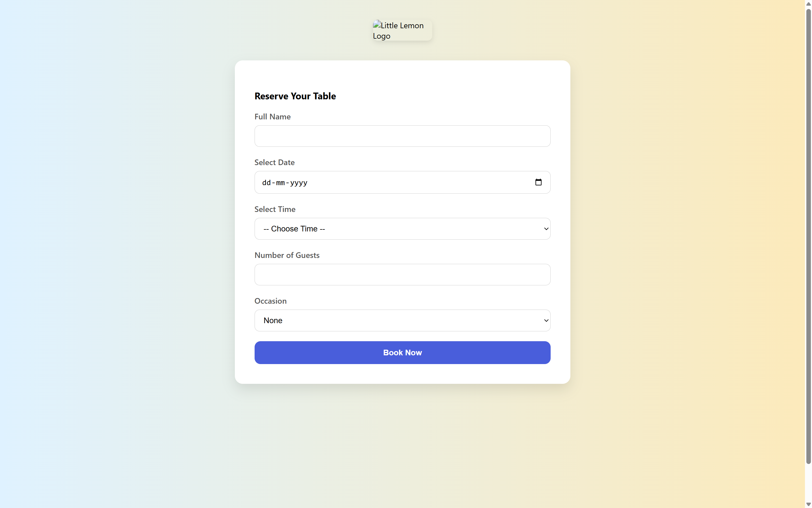
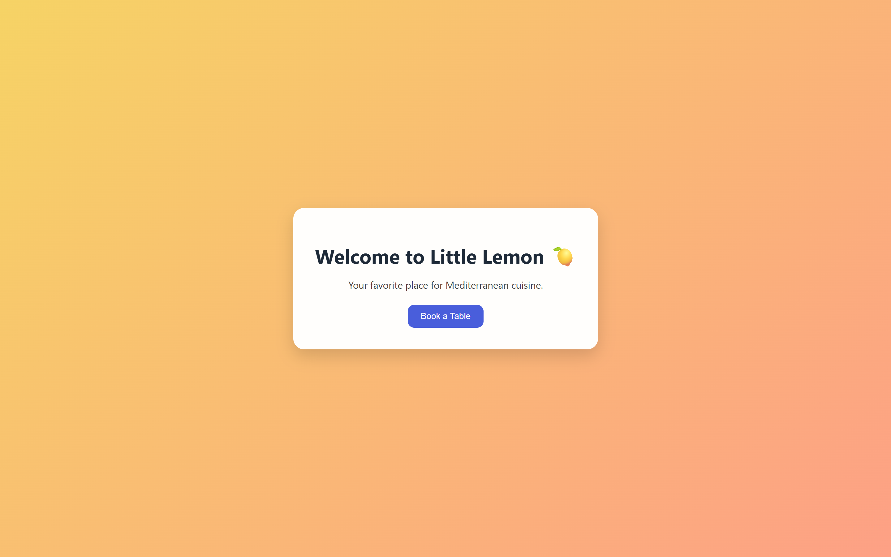

# 🍋 Little Lemon - Table Booking App (React Capstone Project)

This project is part of the **Meta Front-End Developer Capstone** on Coursera. The app allows users to book a table at the Little Lemon restaurant. It demonstrates advanced React concepts, accessibility, form validation, semantic HTML, and responsive design.

 <!-- Replace with actual screenshot if needed -->


---

## 🚀 Features

- ✅ Fully functional table booking form
- ✅ Form validation with error handling
- ✅ Accessible design with semantic HTML
- ✅ Responsive layout for all devices
- ✅ Modular components with CSS styling
- ✅ Git version-controlled with clean commits
- ✅ Modern, clean UI inspired by real-world booking systems

---

## 🛠️ Tech Stack

- **React.js**
- **JavaScript (ES6+)**
- **HTML5 / CSS3**
- **Git + GitHub**

---

## 📁 Project Structure

```

little-lemon-booking/
│
├── public/
│   └── index.html
├── src/
│   ├── components/
│   │   ├── BookingForm.js
│   │   ├── BookingForm.css
│   ├── pages/
│   │   ├── Homepage.js
│   │   ├── BookingPage.js
│   │   ├── BookingPage.css
│   ├── App.js
│   ├── index.js
│   ├── setupTests.js
│   └── ...
├── package.json
└── README.md

````

---

## 🧪 Testing

- Unit test file(s) included for form logic and behavior.
- To run tests:

```bash
npm test
````

---

## 📸 Screenshots

| Homepage                                                        | Booking Page                                                          |
| --------------------------------------------------------------- | --------------------------------------------------------------------- |
| |  |

---

## 🔍 Accessibility & UX/UI

* All form fields include associated `<label>` tags
* Uses clear visual focus indicators
* Mobile-friendly layout using Flexbox/Grid
* Buttons and inputs use semantic roles
* Minimal color contrast is maintained for readability

---

## ✅ Submission Checklist

* [x] Followed Coursera UI/UX design mock
* [x] GitHub repository is public and accessible
* [x] Booking form is functional with validation
* [x] Code is modular, clean, and styled
* [x] Semantic HTML and ARIA practices followed
* [x] Included at least one unit test
* [x] Submitted GitHub repo link in the Coursera peer-review portal

---

## 🔗 Live Preview (Optional)

If deployed, include the link here:

<!-- > [https://yourusername.github.io/little-lemon-booking](https://yourusername.github.io/little-lemon-booking) -->

---

## 👤 Author

**Mayank Maurya**
Meta Front-End Developer Program – Capstone Project
GLA University | 2023–2027

---

## 📜 License

This project is part of an academic submission and follows [Coursera Honor Code](https://www.coursera.org/about/honorcode). It is not for commercial use.
